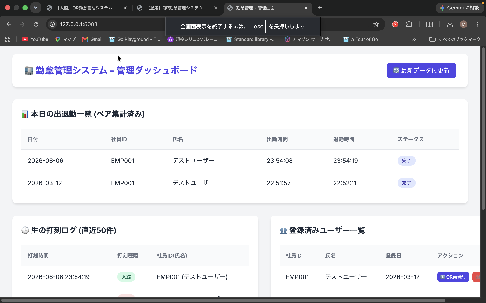
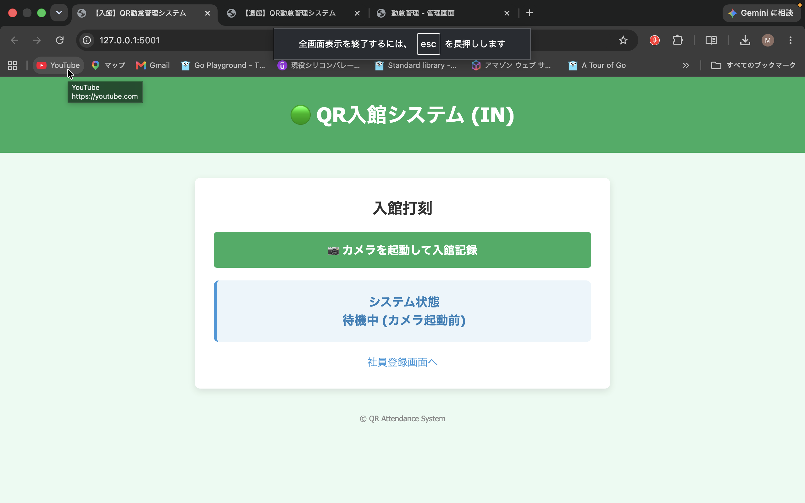
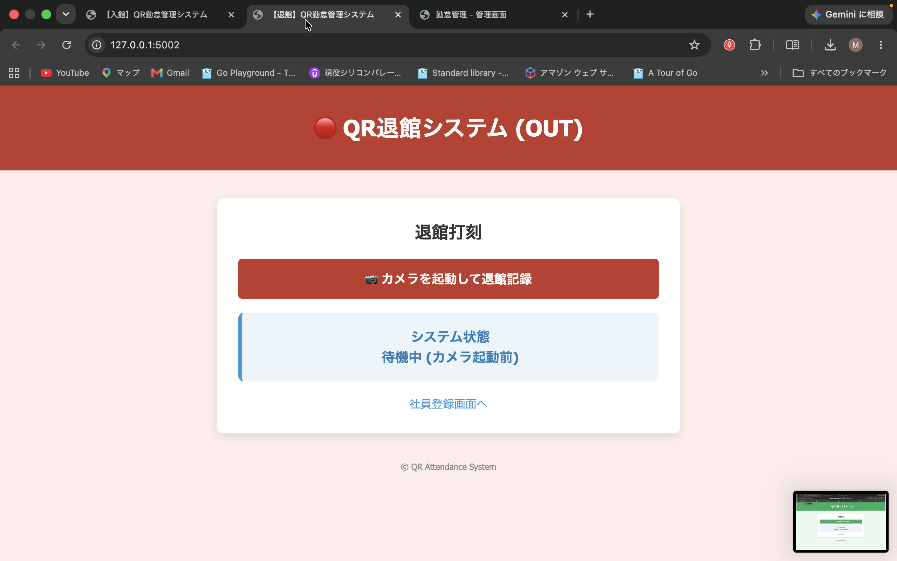
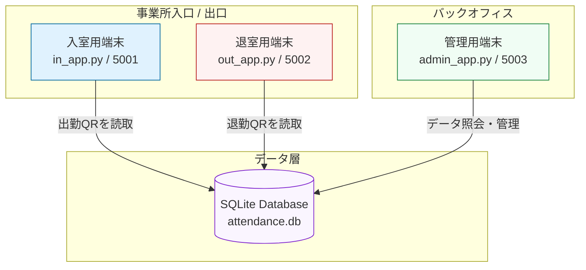

# QRコード勤怠管理システム

[](https://www.python.org/)
[](https://flask.palletsprojects.com/)
[](https://opencv.org/)
[](https://www.sqlite.org/index.html)

**〜 PC内蔵カメラとQRコードだけで実現する、UIレスでスマートな出退勤記録システム 〜**

---

## 📸 スクリーンショット

### 📊 管理ダッシュボード (admin_app)

*当日の打刻状況、ユーザー一覧、生の打刻ログをリアルタイムに確認・管理できます。*

### 📥 入館用端末 (in_app)

*入口設置用の入館打刻専用画面。*

### 📤 退館用端末 (out_app)

*出口設置用の退館打刻専用画面。*

---

## 📌 プロジェクト概要

本アプリケーションは、**PC内蔵カメラを使用してユーザー（社員等）のQRコードをリアルタイムに検知・読み取り、出勤・退勤の打刻を完全自動で記録する勤怠管理システム**です。

マウスやキーボードによる「画面操作」を一切必要とせず、QRコードをカメラにかざすだけで完了する「UIレス」な仕組みを実現しています。また、クラウド環境を必要とせず、PC1台（ローカル環境）とSQLiteデータベースのみで稼働するため、小規模事業所や店舗、イベント会場等での導入を想定した実用的な構成となっています。

### 💡 設計の変遷：1画面から「三分割」への進化

当初は1つの画面でQRコードの読み取りから勤怠管理までを行う設計を考えていました。

しかし実装を進める中で、以下の課題が発生しました。

*   **QRコードの連続読み取りによる二重打刻**
*   **出勤 / 退勤判定ロジックの複雑化**
*   **画面の責務が混在**

そのため設計を見直し、システムを以下の3つに明確に分割しました。

1.  **入場QR読み取り端末**（専用の入り口端末を想定）
2.  **退場QR読み取り端末**（専用の出口端末を想定）
3.  **管理画面**（管理者による確認・修正用）

これにより、打刻ミスの物理的な防止と、システムの保守性向上を実現しました。

---

## 🏗️ システム構成図 (System Architecture)

本システムは、実運用での「打刻ミス防止」のために、機能ごとに端末の役割を分散させたマルチクライアント構成を採用しています。



---

## 📂 ドキュメント構成（詳細資料）

本システムの要件定義、システム設計図面、および具体的な操作手順（QRコードの発行など）については、以下の専用ドキュメントをご参照ください。

* 01. 📄 **[プロジェクト概要](./docs/01_project_overview.md)**
* 02. 📋 **[要件定義](./docs/02_requirements.md)**
* 03. 🛠️ **[技術選定](./docs/03_technology_selection.md)**
* 04. 🏗️ **[システム構成](./docs/04_system_architecture.md)**
* 05. 📊 **[データベース設計](./docs/05_database_design.md)**
* 06. 🖥️ **[画面仕様書](./docs/06_screen_spec.md)**
* 07. 📖 **[セットアップガイド](./docs/07_setup.md)**
* 08. 📝 **[開発ログ (DevLog)](./docs/08_development_log.md)**
* 09. 🗺️ **[画面遷移図 (HTML)](./docs/09_screen_flow.html)**
* 10. 🎭 **[ユースケース図 (HTML)](./docs/10_usecase.html)**

---

## 🧠 システムの主な特徴・設計ポイント

### 1. 業務フローに基づく「状態」の自動判定
単に読み取った時間を記録するだけでなく、SQLiteの直近データを参照し、**「本日はまだ出勤していないか？（無条件に出勤打刻）」「本日はすでに出勤しているか？（退勤打刻に更新）」**という業務ロジックを自動で判定します。

### 2. 二重打刻・不正処理の防止（エラー保護）
QRコードをかざし続けてしまった場合や、数分以内に誤って再度打刻してしまった場合など、実運用で発生しやすい「二重打刻エラー」をステートマシンによって検知し、データの上書きを防ぎます。

### 3. 画像処理（OpenCV）と業務処理の分離
カメラのフレームからQRコードの矩形と文字列をデコードする専用ロジックと、打刻データを管理・保存するバックエンド処理を疎結合（分離）にし、将来的な顔認証システム等への拡張やユニットテストへの移行を容易にしています。

---

## 🛠 採用技術 / Tech Stack

| 領域 | 技術・ツール | 選定理由 |
| :--- | :--- | :--- |
| **言語** | Python 3.10+ | バックエンドAPIと画像解析（AI/ML等の拡張）を同一言語でシームレスに統合できるため。 |
| **Webフレームワーク** | Flask | 重厚なDjangoよりもディレクトリ構成の自由度が高く、軽量なAPIサーバー構築に適しているため。 |
| **画像処理** | OpenCV | ブラウザJS処理よりも精緻なカメラ制御やパフォーマンスチューニングが可能であるため。 |
| **データベース** | SQLite | RDBMSの基礎を押さえつつ、インフラ設定なしにデプロイ・ローカル運用が可能なため。 |
| **ライブラリ等** | qrcode | 社員証などの物理的な認証カードを手軽に発行（生成）する仕組みを提供するため。 |

---

## 🚀 クイックスタートガイド (誰でも動かせる手順)

このリポジトリをダウンロードして、あなたのPCで動かすための最短手順です。

### 1. 準備：リポジトリの取得
ターミナル（Mac）またはコマンドプロンプトを開き、以下のコマンドを入力します。
```bash
git clone https://github.com/あなたのユーザー名/qr-attendance-system-v2.git
cd qr-attendance-system-v2
```

### 2. 環境構築
Python 3.10以上が必要です。必要なライブラリをインストールします。
```bash
pip install -r requirements.txt
```

### 3. 初期化（初回のみ）
データベースを空の状態で作成します。
```bash
python db/init_db.py
```

### 4. アプリケーションの同時起動
本システムは「入り口用」「出口用」「管理用」が分かれています。
以下のコマンドを実行すると、すべてのアプリを一括で起動できます。

```bash
python start_all.py
```

起動後、以下のURLから各画面にアクセスしてください。
*   **入館用**: `http://127.0.0.1:5001`
*   **退館用**: `http://127.0.0.1:5002`
*   **管理用**: `http://127.0.0.1:5003`

---

## 🛠 手動での起動方法（開発・デバッグ用）
個別に起動する場合は、3つのターミナルを開き、それぞれ以下のコマンドを実行してください。

---

## 📸 動作確認のコツ

1.  **QRコードの発行**: `python generate_qr.py` を実行し、好きなID（例: `EMP001`）を入力してQRを作成してください。
2.  **スマホで表示 or 印刷**: `qrcodes/` フォルダにできた画像を開きます。
3.  **カメラにかざす**: 起動した出勤（または退勤）アプリの画面で、カメラにQRを映すと即座に打刻されます。
4.  **管理画面を確認**: 管理者用画面（5003番）を開くと、打刻ログがリアルタイムに表示されます。

---

## 🛡️ セキュリティとプライバシー

*   **ローカル実行**: 本システムは外部サーバーと通信しません。データ（SQLite）はすべてあなたのPC内に保存されます。
*   **ホスト設定**: ネットワーク経由の意図しないアクセスを防ぐため、`127.0.0.1`（ローカルホスト）でのみ動作するように設定されています。
*   **カメラ権限**: 初回起動時、Mac/Windowsからカメラアクセスの許可を求められた場合は「OK」を押してください。

---

*このプロジェクトは、実運用に近い「端末の分離」と「UIレスな操作感」を重視して設計されています。*

---
