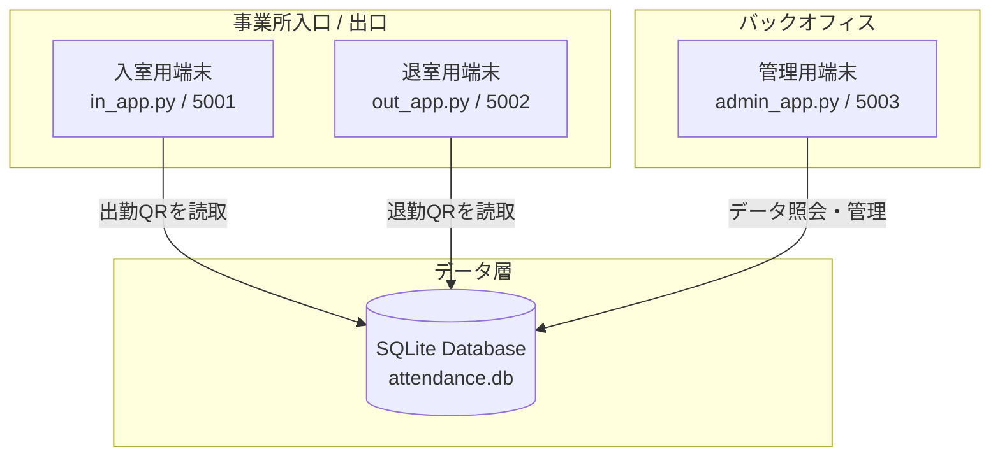
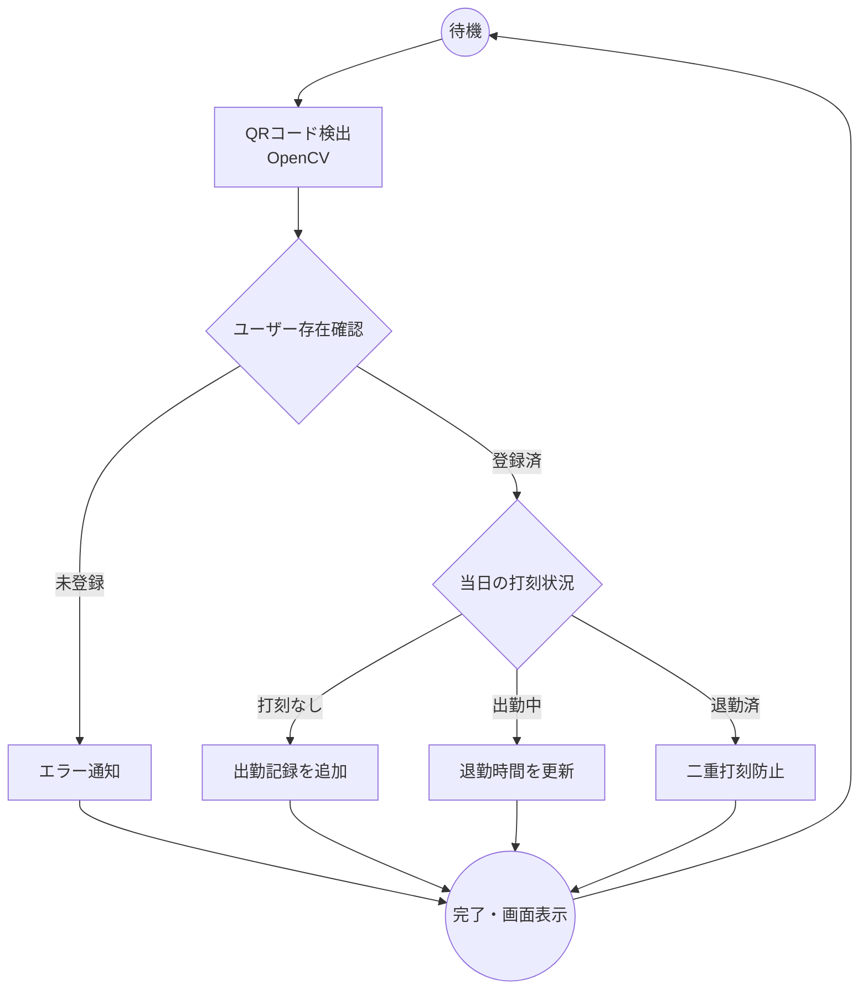

# 04. システムアーキテクチャ (System Architecture)

## 🏗️ 全体構成
本システムは、実運用での打刻ミスを物理的に防ぐため、役割ごとに独立した3つのポート（端末）が共通のデータベースを参照する構成を採用しています。

## 🔄 処理フロー（状態遷移）
QRコード読み取り時のシステム挙動は、以下のフローチャートに基づいて判定されます。

## 🔌 端末ごとの役割
1. **入室用端末 (5001)**: 社員が最初に出社した際にQRをかざす専用端末。
2. **退室用端末 (5002)**: 社員が退勤する際にQRをかざす専用端末。
3. **管理者アプリ (5003)**: 社員登録、QR発行、勤怠状況の監視を担当するバックオフィス用。
