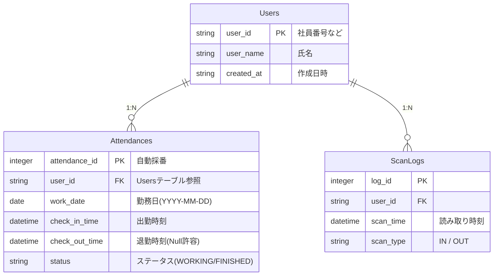

# 05. データベース設計 (Database Design)

## 📊 ER図 (ER Diagram)
本システムでは、生の読み取りログと、業務上の意味を持つ勤怠データを分離して管理しています。

## 🗄️ テーブル定義

### 1. Users (ユーザー情報)
社員や利用者の基本情報を管理します。

### 2. Attendances (勤怠情報)
1日単位の出勤・退勤ペアを管理します。`check_out_time` が NULL の場合は現在勤務中として扱われます。

### 3. ScanLogs (打刻生ログ)
カメラがQRコードを検知した「瞬間」をすべて記録します。監査ログとしての役割や、二重打刻防止の判定基準として利用されます。

## 💡 設計の工夫
* **ステータス管理**: `status` カラムを持つことで、「今誰が出勤中か」を即座にクエリ可能にしています。
* **履歴の永続性**: 直近の打刻ログだけでなく、すべてのスキャン履歴を残すことで、後からの遡及修正やトラブル時の調査を可能にしています。
